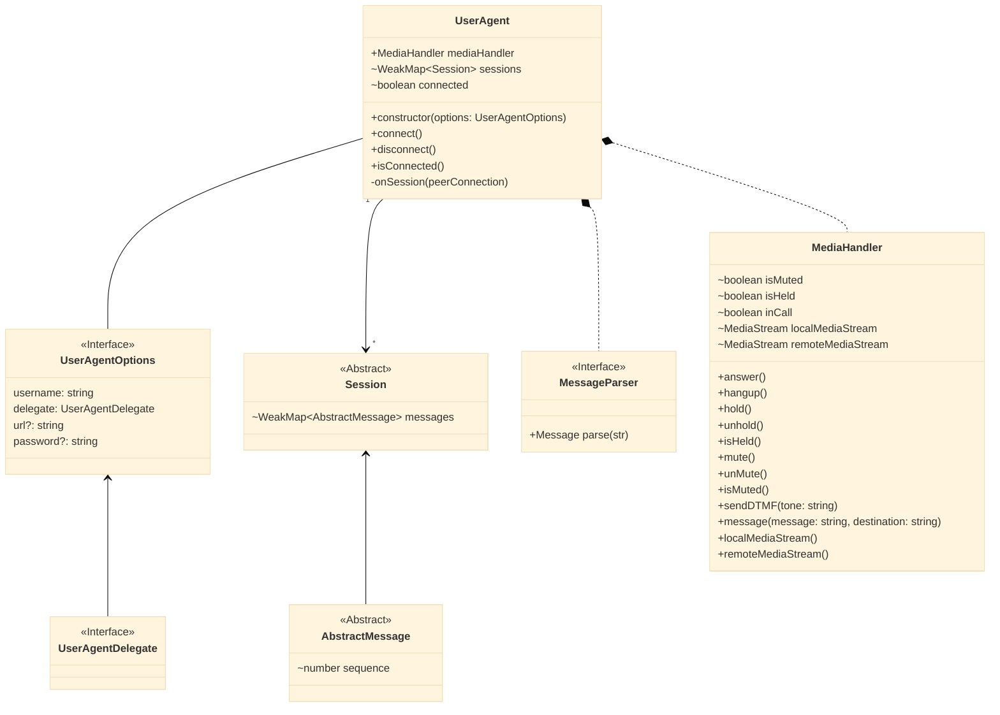
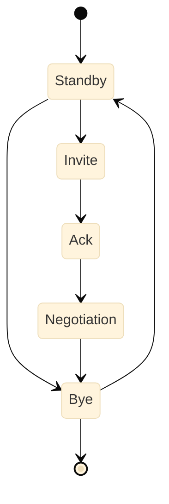

[TOC]: #

# Table of Contents
- [SIP](#sip)
- [UserAgent](#useragent)
  - [UserAgentDelegate](#useragentdelegate)
  - [UserAgentDelegate - Eksempel](#useragentdelegate---eksempel)
- [Session](#session)
- [AbstractMessage](#abstractmessage)
- [Indregistrering](#indregistrering)
- [Opkald](#opkald)
- [Viderestilling](#viderestilling)
  - [Blind](#blind)
  - [Attended](#attended)


Når man skal facilitere et VOIP __(Voice Over IP)__ opkald forgår det
typisk via SIP __(Session Initiation Protocol)__ som er en
signaleringsprotokol, også kendt som application-layer control. SIP
bruger flere transport protokoller som TCP, UDP, SCTCP, RSVP m.fl.

En SIP User Agent har til opgave at oprette, modificere og afslutte
sessioner. Disse sessioner inkluderer IP Telefoni, multimedie
distribution og multimedie konferencer.

En user agent vil typisk forbinde til en dedikeret server, der kan
håndtere transcoding af mediet. Men da standarden også tillader to
klienter at snakke sammen, dvs. at de både agere klient og server, vil
løsningen fokusere på dette scenarie for at simplificere projektet.

Teoretisk tillader dette også langt højere kvalitet, da en typisk
telefonsamtale har 64 kbit til rådighed _(PCMA/G.711)_.

Når de to klienter vil oprette forbindelse mellem hinanden, kommunikere
de hvilke funktionaliteter de understøtter (voice, video). Samt codecs
og bitrates.

For at starte et opkald vil den ene sende en __Invite__ besked til den
anden, med disse informationer. Når den modsatte part acceptere, skal
klienterne blive enige om hvordan de kommunikere.

Dette foregår via princippet at højeste fællesnævner bestemmer.

## SIP

SIP er en plain text protokol. I eksemplet herunder, er vist en
__REGISTER__ pakke. Her er også implementeret authorization og
kommunikationen er over WebSocket med TLS.

```http request
REGISTER sip:remotehost SIP/2.0
Via: SIP/2.0/WSS 3af6pj3a8fk4.invalid;branch=z9hG4bK4997110
Max-Forwards: 69
To: <sip:bob@192.168.20.20>
From: <sip:alice@192.168.20.19>;tag=itp46o81e5
Call-ID: Alice
CSeq: 2 REGISTER
Authorization: Digest algorithm=MD5, ...
Contact: <sip:alice@192.168.20.19;transport=ws>;...;expires=600
Expires: 600
Allow: INVITE,ACK,CANCEL,BYE,UPDATE,MESSAGE,OPTIONS,REFER,INFO,NOTIFY
Supported: path,gruu,outbound
User-Agent: sip-ua
Content-Length: 0
```

Meget af den viden man har fra HTTP 1.1 kan man genbruge i SIP land.
__Allow__ kan f.eks. sammenlignes med med CORS headeren
__Access-Control-Allow-Methods__.

Det specielle ved SIP er at alle beskeder indeholder en __CSeq__ header
med en metode og et sekvens id angivet i `integer`. Protokollen tillader
nemlig _Out of Order_ pakker. En user agent og tilsvarende server,
__SKAL__ understøtte dette, da man ellers har en ødelagt implementation.
Vigtigst er at man inkrementere id´et med n+1. Man starter typisk fra
__1__, men dette er ikke så vigtigt.

## UserAgent

En bruger af dette user agent bibliotek vil blive eksponeret overfor en
`UserAgent` klasse, der under alle omstændigheder skal anvendes som
`Singleton`. Grunden til dette er, at det for det første ikke giver
mening at have flere _"telefoner"_ i et browser vindue. Men også fordi i
tilfælde af flere opkald, vil det blive alt for uoverskueligt at
programmere routingen af opkald.

I disse tilfælde skal man bruge en PBX server, hvor man konfigurere
routing tabeller. Men dette er ude af scopet for dette projekt. Dog vil
jeg henvise til [Asterisk](https://www.asterisk.org/) skulle det blive
aktuelt.



En factory funktion ville her være fordelagtigt til instantiering af
`UserAgent`. Denne kan så bindes til en dependency container.

### UserAgentDelegate

Et interface til at binde callbacks til UserAgent events. Disse
callbacks er metoderne til at, binde ens brugerflade til klienten - og
derved kan gøre brugerfladen _reaktionær_.

```typescript
interface Identity {
  // Call ID header or parsed from 'From'|'To'
  // depending on if our side is receiver or sender.
  friendlyName(): string;
  // raw header
  raw(): string;
}

interface Invite {
  sender: Identity;
  withoutSdp: boolean;
}

interface UserAgentDelegate {
  onMessage(message: string, sender: Identity): void;
  // Return true to accept or false to decline
  onInvite(invite: Invite): Promise<boolean>;
  // Called when someone refers a call to us.
  onRefer(referer: Identity, referral: Identity): Promise<boolean>;
  // Allows for hooking into messages.
  onEvent?(event: string, ...args): void;
  // Called when user makes a call.
  onCallCreated?(): void;
  // Called when user is registered to received calls.
  onRegistered?(): void;
  // Called when user is no longer registered to received calls.
  onUnregistered?(): void;
  // Called when user is connected to server.
  onServerConnect?();
  // Called when user is no longer connected.
  // @param error - An Error if server caused the disconnect. Otherwise undefined.
  onServerDisconnect?(error?: Error): void;
}
```

### UserAgentDelegate - Eksempel

```typescript
const delegate: UserAgentDelegate = {
  onMessage(message: string, sender: Identity) {
    console.log(`Received message from: ${sender.friendlyName()}`, message)
  },
  async onInvite(invite: Invite) {
    console.log(`Received invite from ${invite.sender.friendlyName()}`);
    return true; // accept
  },
  async onRefer(referer: Identity, referral: Identity) {
    console.log(
      `Received refer from ${referer.friendlyName()} to ${referral.friendlyName()}`
    );
    return true; // accept
  },
}

const ua = new UserAgent({ url, username, password, delegate });
```

## Session

En UserAgent kan have flere opkald igang. Derfor er sessions gemt på
`UserAgent` som et WeakMap.

I tilfælde af flere opkald, vil det aktive opkald være dét som brugeren
er forbundet til. De andre vil være på `Hold`.


En session afvikles typisk således:



## AbstractMessage

Message pakker skal du som regel ikke bruge i praksis. Da
[UserAgentDelegate](#useragentdelegate), vil dække 99% use-cases. Dog er
det muligt at hooke ind i dem. F.eks. hvis du skal implementere instant
chat.

De konkrete klasser er listet her

| Navn    | Beskrivelse                                                           |
|:--------|:----------------------------------------------------------------------|
| Ack     | Acknowledge                                                           |
| Bye     | Afsluttet opkald                                                      |
| Cancel  | Afbryd opkald                                                         |
| Info    | Applikations nieaveu information. Normalvis relateret til en session. |
| Invite  | Indgående opkald                                                      |
| Message | Indgående Tekst besked                                                |
| Notify  | Ændring af session                                                    |
| Refer   | Omstilling                                                            |
| Update  | Ændring af medie stream                                               |

## Indregistrering

Biblioteket bruger en pinkode som kodeord, når _Alice_ vil snakke med
_Bob_, uden en server i mellem. Aftaler hun at bruge koden __1234__ som
`password`.

En SIP `REGISTER` __SKAL__ altid først sendes uden password. Når den
bliver afvist med status __401__, så aftaler klienterne en `nonce` - som
bliver inkluderet i næste `REGISTER` forsøg. Inklusiv kodeordet.

`nonce` bliver genereret af _Bob_ og sendt til _Alice_. Dette er en
`Password-Challenge` Når _Alice_ så indregistrere igen, så ved _Bob_ at,
det er samme _Alice_ han snakker med - da kun hun vil kende til den
værdi.

Den underlæggende implementation er håndteret af biblioteket. Som bruger
vil dette være gemt under abstraktionen, men det vil dog være en fordel
at have en forståelse af hvordan dette fungerer. Specielt i debug
tilfælde.


[UserAgentDelegate](#useragentdelegate)

`UserAgentDelegate::onRegistered`

## Opkald


[UserAgentDelegate](#useragentdelegate)

__Alice__ `UserAgentDelegate::onCallCreated`

__Bob__ `UserAgentDelegate::onInvite`

## Viderestilling

Når man viderestiller et opkald, er der 2 måder at gøre det på.

### Blind

Ved en blind omstilling, tjekker man ikke om modparten rent faktisk er
klar til at modtage opkaldet. Derimod så sender man bare opkaldet
videre, og så bliver der lagt på.

### Attended

Ved en Attended omstilling, ringer man modparten op og venter på svar.
Her kan man snakke sammen, og forklare hvorfor man omstiller - uden at
personen der skal omstilles kan gøre med. Derved slipper en eventuel
kunde for, at beskrive sit problem igen.


[UserAgentDelegate](#useragentdelegate)

__Alice__ `UserAgentDelegate::onCallCreated`

__Bob__ `UserAgentDelegate::onRefer`

